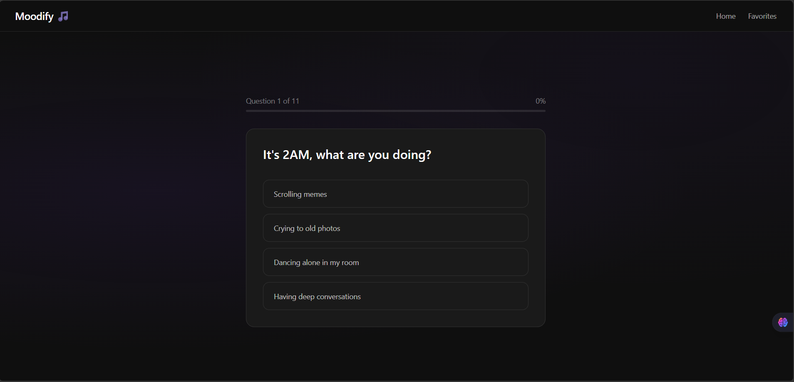
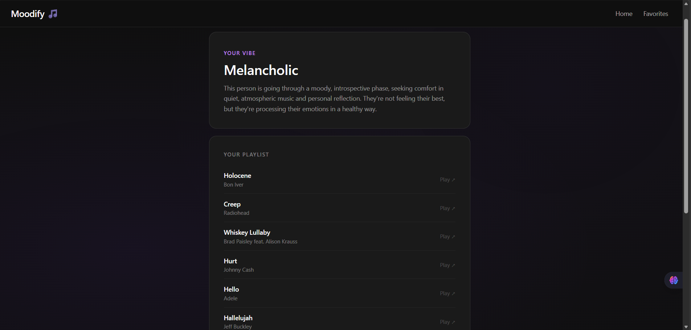

# Moodify 🎵

An AI-powered music personality app that analyzes your vibe and curates the perfect playlist for you.

## Live Demo
[moodify.vercel.app](https://moodify-egl2naj31-oorrviis-projects.vercel.app/)

## Features
- 11 unique personality questions to determine your music vibe
- AI analysis powered by Claude to match your personality to one of 11 music moods
- Song recommendations with direct Spotify links
- Save your favorite playlists for later
- Clean dark UI built with Tailwind CSS

## Music Moods
Melancholic, Chill/Lofi, Energetic, Intense/Rock, Romantic, Party, Gym, Focus/Study, Heartbreak, Nostalgic, Spiritual/Peace

## Tech Stack
- **Frontend** — React + Vite
- **Styling** — Tailwind CSS
- **Routing** — React Router DOM
- **AI** — Claude AI via OpenRouter API
- **Deployment** — Vercel

## Getting Started

### Prerequisites
- Node.js
- OpenRouter API key

### Installation

```bash
git clone https://github.com/oorrvii/moodify.git
cd moodify
npm install
```

### Environment Variables
Create a `.env` file in the root directory:
```
OPENROUTER_API_KEY=your_key_here
```

### Run locally
```bash
npm run dev
```

### Deploy
```bash
vercel --prod
```

## Project Structure
```
src/
  components/
    Navbar.jsx
  pages/
    Home.jsx
    Results.jsx
    Favorites.jsx
  data/
    questions.js
  App.jsx
api/
  claude.js
```

## Screenshots



## Author
Made by [oorrvii](https://github.com/oorrvii)